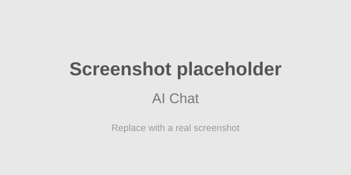
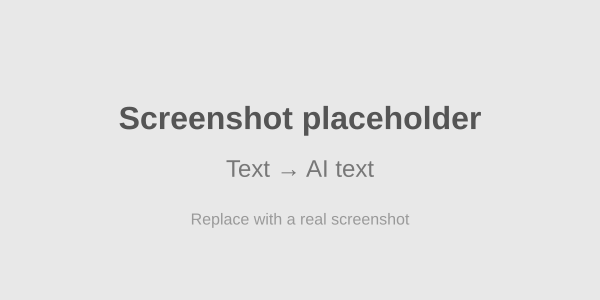
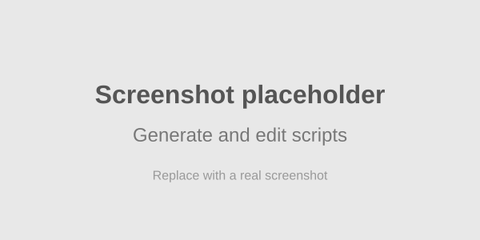
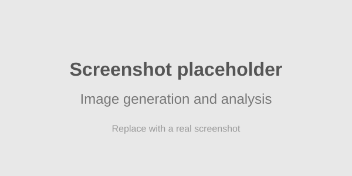
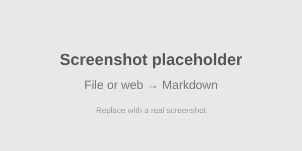
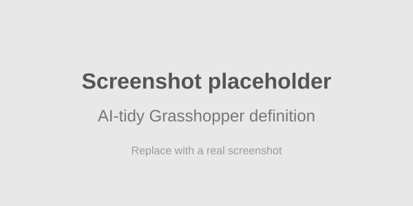
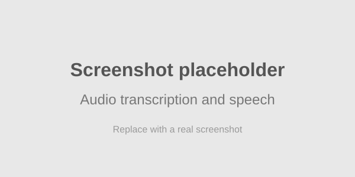
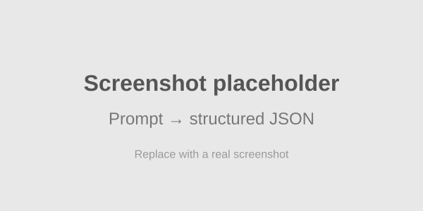

# SmartHopper - AI-Powered Tools and Assistant for Grasshopper3D

[](https://github.com/architects-toolkit/SmartHopper/releases)
[](https://github.com/architects-toolkit/SmartHopper/releases)
[](https://github.com/architects-toolkit/SmartHopper/actions/workflows/ci-dotnet-tests.yml)
[](https://smarthopper.xyz/#installation)
[](https://github.com/architects-toolkit/SmartHopper/blob/main/LICENSE)
[](https://deepwiki.com/architects-toolkit/SmartHopper)

<div align="center">

[](https://smarthopper.xyz)

> As designers, we don't settle for finished products: we make them.  
> SmartHopper is an evolving toolkit that connects Grasshopper with AI, so you can make more, explore faster, and turn ideas into working definitions.

**100+ AI tools · 100+ Grasshopper components · 8 AI providers · MCP Server**


</div>

---

SmartHopper brings a context-aware AI assistant and a suite of AI-powered components into Grasshopper3D. It gives designers a direct, native way to use large language models, image models, audio models, and web knowledge inside their parametric workflows — without leaving the canvas.

## What you can do with SmartHopper

- **Chat with an AI that sees your canvas.** Ask questions in plain language. The assistant can read your components, search the McNeel and Ladybug forums, browse any Discourse forum, and search the web for answers.
- **Generate and edit scripts.** Describe what you want in Python, C#, VB.NET, or IronPython, and SmartHopper writes the script component for you.
- **Work with any media.** Generate images from prompts, describe images, transcribe audio, synthesize speech, and turn PDFs, Word docs, Excel files, and web pages into text the AI can use.
- **Build and edit definitions with AI.** Add, connect, tidy, merge, diff, and patch Grasshopper components. SmartHopper is the native home of **GhJSON**, the community plain-text format that makes Grasshopper definitions readable by AI and version control.
- **Native Grasshopper data types, no formatting headaches.** AI responses come back as numbers, booleans, text, text lists, integers, images, audio, JSON, and Grasshopper JSON — the types you already wire together. No manual parsing, no LLM formatting mistakes.
- **Use the AI provider you prefer.** OpenAI, Anthropic, Google Gemini, Mistral, DeepSeek, OpenRouter, or run locally with Ollama and LocalAI.

> **The native home of [GhJSON](https://github.com/architects-toolkit/ghjson-spec).** SmartHopper created and supports GhJSON, a community file format that stores Grasshopper definitions as plain text. That means you can share, diff, patch, and edit your definitions with AI and version control, just like any other text file.

## How it works

SmartHopper connects your ideas, your Grasshopper canvas, and the AI provider of your choice in a single workflow. It reads context from your definition, sends a structured request to the AI, and returns the result as native Grasshopper data you can wire straight into your components.

```text
        [Your idea]
            +
   [Your Grasshopper context]
            ↓
    [SmartHopper component or chat interface]
            ↓
    [Your AI provider]
            ↓
 [Native Grasshopper output]
```

1. **Drop a component** or open the AI chat.
2. **Describe what you want** in plain language, or let SmartHopper read the components already on your canvas.
3. **Receive native Grasshopper data** — text, numbers, booleans, images, audio, JSON, scripts, or even placed components on canvas.
4. **Keep iterating** without leaving Rhino, switching apps, or parsing raw LLM output.

## Component gallery

| AI Chat | Text → AI text |
|---|---|
|  |  |

| Generate scripts | Image → text or text → image |
|---|---|
|  |  |

| File or web → Markdown | Let AI tidy your definition |
|---|---|
|  |  |

| Transcribe or synthesize audio | Prompt → structured JSON |
|---|---|
|  |  |

## AI providers

SmartHopper works with the providers you already use. Check the [full provider feature matrix](DEV.md#%E2%9E%A1%EF%B8%8F-available-providers) for streaming, image generation, tool calling, batch processing, and more.

-  [MistralAI](https://mistral.ai/)
-  [OpenAI](https://openai.com/)
-  [DeepSeek](https://deepseek.com/)
-  [Anthropic](https://anthropic.com/)
-  [OpenRouter](https://openrouter.ai/)
-  [Google Gemini](https://ai.google.dev/)
-  [LocalAI](https://localai.io/) — self-hosted, OpenAI-compatible
-  [Ollama](https://ollama.com/) — local, OpenAI-compatible

## Installation

**System requirements:**

- Rhino 8.0 or newer on Windows or macOS
- A provider API key to use most AI features, or a local Ollama/LocalAI server

**Install SmartHopper**

- **Stable release:** install the latest stable version from the **Rhino Package Manager**.
- **Want the latest experimental features?** Pre-releases and the newest development builds are published on [GitHub Releases](https://github.com/architects-toolkit/SmartHopper/releases). Download directly from there and place all files in the Grasshopper > Components folder.

**Quick start:**

1. Install SmartHopper.
2. Restart Rhino and open Grasshopper.
3. Open SmartHopper settings and add an API key for your chosen provider, or set up a local Ollama/LocalAI server.
4. Drop a SmartHopper component and start designing with AI.

[Watch the quickstart video on Vimeo](https://vimeo.com/1126454690)

**What's next?** Explore the [Getting Started guide](docs/GETTING_STARTED/index.md) and the [full component reference](docs/Components/index.md) to start building with AI in Grasshopper.

## Learn more: some video tutorials to get started

- [Canvas assistant (AI chat)](https://vimeo.com/1126454713)
- [Generate and edit script components](https://vimeo.com/1144166204)
- [AI-powered components](https://vimeo.com/1126454744)
- [Select an AI provider](https://vimeo.com/1126547055)

## Contributing

Every great innovation starts with a single contribution. Whether you're a designer, developer, or AI enthusiast, your unique perspective can help shape the future of computational design tools.

Please see our [Contributing Guidelines](CONTRIBUTING.md) for details on how to contribute to this project.

## Changelog

See [Releases](https://github.com/architects-toolkit/SmartHopper/releases) for a list of changes and updates.

## License

This project is licensed under the GNU Lesser General Public License v3 (LGPL) - see the [LICENSE](LICENSE) file for details.

## Trademark and Logo Usage Policy

The SmartHopper name and logo are the property of the SmartHopper / architects-toolkit maintainers. The LGPL v3 license under which the source code is distributed does **not** grant rights in the SmartHopper name or logo.

We allow use of the SmartHopper name and logo in the following contexts:

- In blog posts, articles, tutorials, talks, or reviews that discuss or promote SmartHopper, provided the usage is accurate, fair, and does not imply endorsement by the SmartHopper maintainers.
- In educational materials, courses, or presentations that accurately represent the project.
- When referring to the unmodified, official SmartHopper plug-in as installed from the Rhino Package Manager.

Please refrain from using the SmartHopper name and logo:

- In promotional materials for paid services or commercial products that bundle, redistribute, or extend SmartHopper, without prior written permission.
- In a manner that may cause confusion about the origin of a product or imply endorsement.
- On forks, derivative works, or paid offerings derived from the SmartHopper source code — please choose a distinct name and logo for your fork, as is common open-source trademark practice.

If you have any questions or wish to seek permission for other uses, please open an issue on this repository or contact the maintainers via [smarthopper.xyz](https://smarthopper.xyz).

Thank you for your understanding and cooperation.

---

<div align="center">
Started in Barcelona — spread worldwide    •    <a href="https://smarthopper.xyz">smarthopper.xyz</a>
</div>
