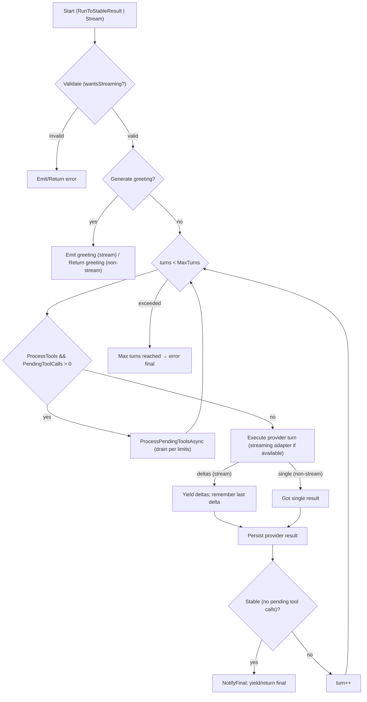

# ConversationSession

Location: `src/SmartHopper.Infrastructure/AICall/Sessions/`

Purpose: Centralize multi-turn conversation orchestration with optional streaming. The session delegates provider calls to `AIRequestCall` and can stream incremental `AIReturn` deltas using provider-specific streaming adapters.

## Types

- `IConversationSession`
  - `AIRequestCall Request { get; }`
  - `Task<AIReturn> RunToStableResult(SessionOptions options, CancellationToken ct = default)`
  - `IAsyncEnumerable<AIReturn> Stream(SessionOptions options, StreamingOptions streamingOptions, CancellationToken ct = default)`
  - `void Cancel()`
- `IConversationObserver`
  - `OnStart(AIRequestCall request)`
  - `OnDelta(IAIInteraction interaction)`
  - `OnInteractionCompleted(IAIInteraction interaction)`
  - `OnToolCall(AIInteractionToolCall toolCall)`
  - `OnToolResult(AIInteractionToolResult toolResult)`
  - `OnFinal(AIReturn finalResult)`
  - `OnError(Exception error)`
- `SessionOptions`
  - `ProcessTools` (bool): process pending tool calls in the result.
  - `MaxTurns`, `MaxToolPasses`, `AllowParallelTools` (reserved for future phases)
  - `CancellationToken`
- `ConversationSession`
  - Orchestrates provider calls via `AIRequestCall.Exec()` for non-streaming and via provider streaming adapters for streaming, runs bounded turns/tool passes, and forwards lifecycle events to `IConversationObserver`.
  - Tool execution
    - Pending tool calls (`AIInteractionToolCall`) are executed via the Tool Manager during tool passes.
    - For executing exactly one pending tool call directly, see `AIToolCall` in `src/SmartHopper.Infrastructure/AICall/Tools/AIToolCall.cs` and the Tools docs.

## Usage

```csharp
// Explicit session (recommended for tools/multi-turn)
var session = new ConversationSession(req);
var options = new SessionOptions
{
    ProcessTools = true,
    MaxTurns = 3,
    MaxToolPasses = 2,
};
var result = await session.RunToStableResult(options);
```

## Streaming

When the selected provider/model supports streaming, use `Stream(...)` to consume incremental deltas:

```csharp
var streaming = new StreamingOptions
{
    CoalesceTokens = true,
    CoalesceDelayMs = 40,
    PreferredChunkSize = 24,
};

await foreach (var delta in session.Stream(options, streaming, ct))
{
    // Render partial UI, inspect delta.Body.Interactions, etc.
}
```

Notes:

- `ConversationSession.Stream(...)` gates streaming using request validation rules. If streaming is unsupported or disabled, an error `AIReturn` is yielded and the sequence ends.
- For the canonical and detailed streaming behavior (adapter probing, delta vs partial events, persistence timing, fallback, and tool passes), see `docs/Providers/AICall/Streaming.md`. This page intentionally summarizes to avoid duplication.
- `Exec()` performs a single provider call. Use `ConversationSession` for orchestration and streaming.
- Policy pipeline hooks remain active in both streaming and non-streaming paths.
- See also: Tools overview and `AIToolCall` usage in [./tools.md](./tools.md).

## Conversation flow (Unified)

The diagram below shows the unified orchestration used by `ConversationSession.cs`. Both `RunToStableResult(...)` and `Stream(...)` delegate to the same internal turn loop; the only difference is emission: `Stream(...)` yields deltas and final snapshots, while `RunToStableResult(...)` collects and returns the final stable result.



Notes:

- Both public APIs now delegate to the same internal loop `TurnLoopAsync(...)` for consistent behavior.
- Streaming uses provider adapters when available and falls back to a single non-streaming provider turn when not.
- Persistence semantics: streaming deltas are persisted into history as they arrive, strictly preserving provider order. At stream end, only the "last return" snapshot is updated (no grouping or reordering).

## Special Turns

Special turns allow executing AI requests with custom overrides (interactions, provider, model, tools, context) while leveraging the regular conversation flow infrastructure.

```csharp
var greetingConfig = GreetingSpecialTurn.Create(providerName, systemPrompt);
var greeting = await session.ExecuteSpecialTurnAsync(
    greetingConfig,
    preferStreaming: true,
    cancellationToken);
```

**Key features:**

- Execute through regular conversation flow with automatic state snapshot/restore
- Four persistence strategies: `PersistResult`, `PersistAll`, `Ephemeral`, `ReplaceAbove`
- Interaction filtering for granular control over what's persisted
- Support both streaming and non-streaming modes
- Transparent to observers (they only see what gets persisted)

**See also:** [SpecialTurns.md](./SpecialTurns.md) for detailed documentation and use cases.
