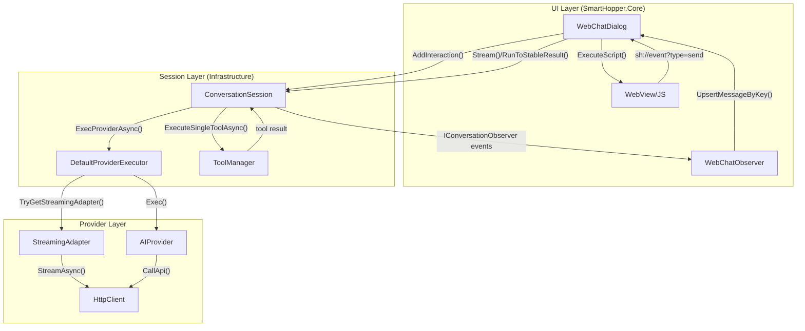
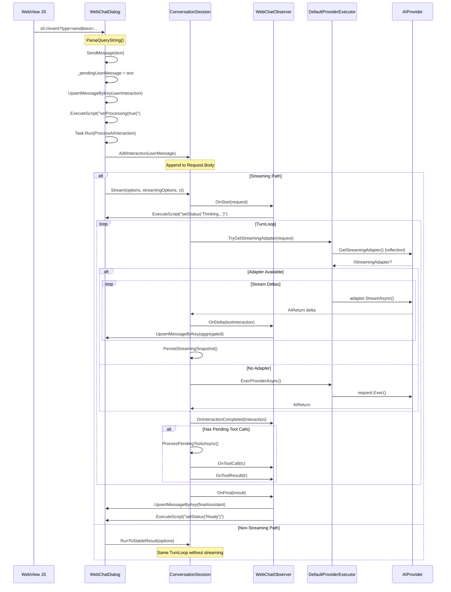
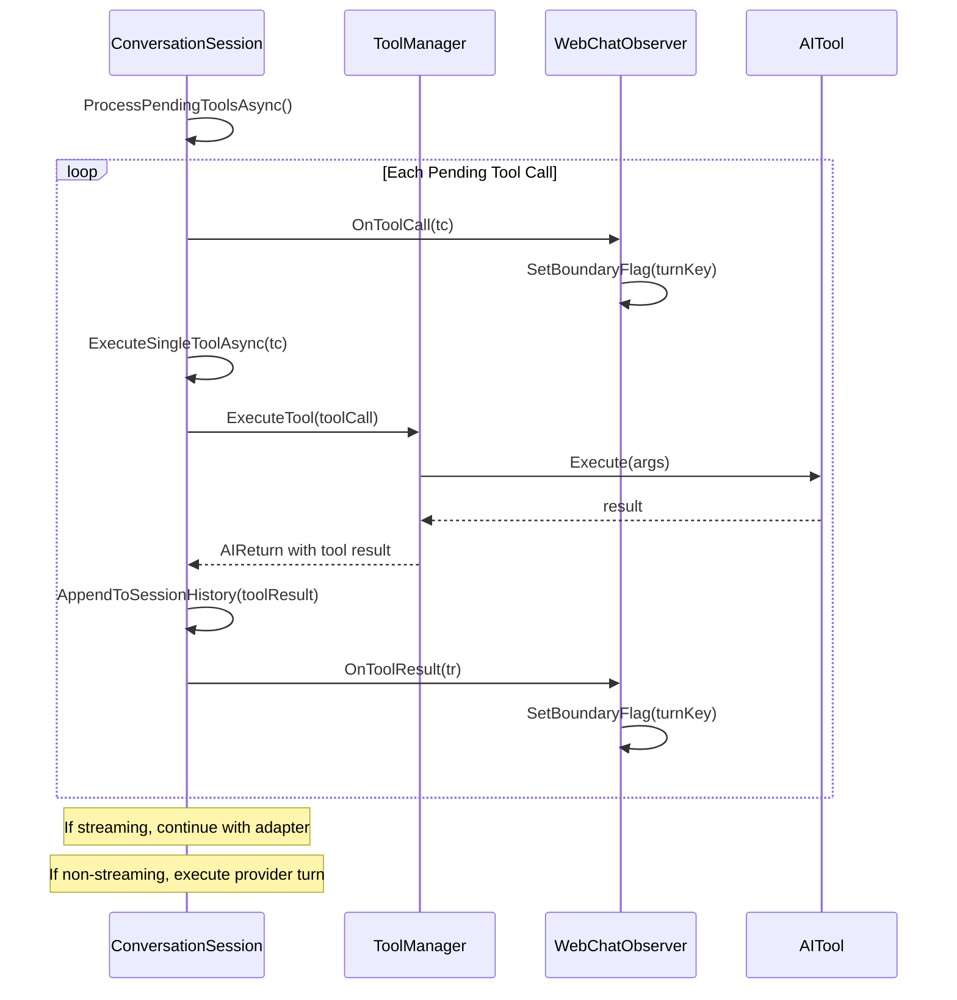
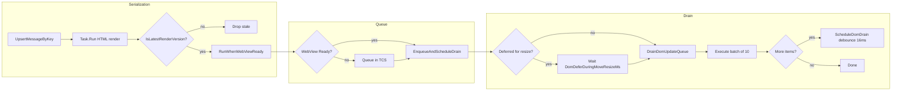
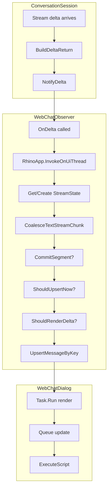
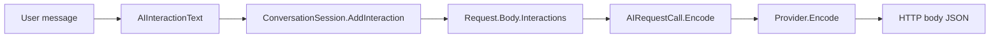
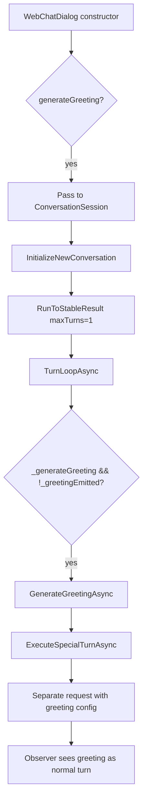
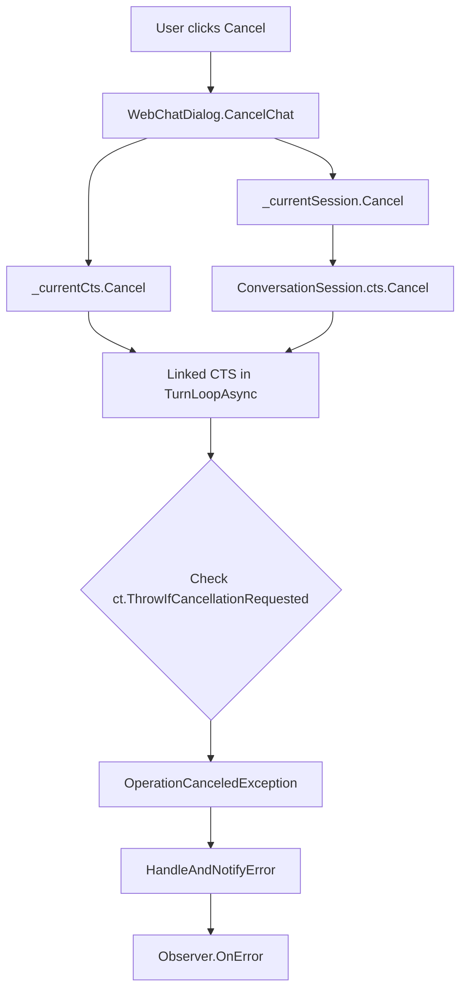

# WebChat Performance Review

**Date**: December 25, 2024  
**Scope**: `WebChatDialog.cs`, `ConversationSession.cs`, `AIProvider.cs` interaction analysis  
**Author**: Performance Review Bot

---

## Executive Summary

This review analyzes the interaction between the WebChat UI layer (`WebChatDialog`, `WebChatObserver`), the conversation orchestration layer (`ConversationSession`), and the provider execution layer (`AIProvider`). The analysis identifies performance bottlenecks, architectural inconsistencies, and opportunities for simplification.

**Key Findings**:

- Complex data flow with multiple abstraction layers adds latency
- Streaming and non-streaming paths have duplicated logic
- Observer pattern creates tight coupling between UI and session
- Provider-specific streaming adapter discovery uses reflection at runtime
- DOM update serialization is well-designed but complex

---

## 1. Architecture Overview

### 1.1 Component Responsibilities

| Component | Responsibility |
|-----------|---------------|
| `WebChatDialog` | UI host, WebView management, DOM update serialization, event bridging |
| `WebChatObserver` | Converts session events to UI updates, streaming aggregation, throttling |
| `ConversationSession` | Multi-turn orchestration, tool execution, history management |
| `AIProvider` | HTTP calls, request encoding/decoding, model selection |
| `DefaultProviderExecutor` | Provider and tool execution delegation, streaming adapter probing |

### 1.2 High-Level Flow Diagram



---

## 2. Detailed Flow Analysis

### 2.1 User Message Flow (Send Message)



### 2.2 Streaming vs Non-Streaming Decision

```mermaid
flowchart TD
    START[ProcessAIInteraction] --> VAL{Validate streaming?}
    VAL -->|WantsStreaming=true| CHECK{IsValid()?}
    CHECK -->|valid| STREAM[Stream path]
    CHECK -->|invalid| NS[Non-streaming fallback]
    VAL -->|error| NS
    
    STREAM --> ADAPTER{Has StreamingAdapter?}
    ADAPTER -->|yes| SSE[SSE streaming]
    ADAPTER -->|no| SINGLE[Single provider call]
    
    SSE --> DELTAS[Yield deltas]
    DELTAS --> PERSIST[PersistStreamingSnapshot]
    
    SINGLE --> MERGE[Merge interactions]
    
    NS --> RUN[RunToStableResult]
    RUN --> LOOP[TurnLoopAsync yieldDeltas=false]
    
    PERSIST --> TOOLS{Pending tool calls?}
    MERGE --> TOOLS
    TOOLS -->|yes| EXEC_TOOLS[ProcessPendingToolsAsync]
    TOOLS -->|no| FINAL[NotifyFinal]
    EXEC_TOOLS --> LOOP2{More turns?}
    LOOP2 -->|yes| ADAPTER
    LOOP2 -->|no| FINAL
```

### 2.3 Tool Call Processing Flow



---

## 3. Performance Analysis

### 3.1 DOM Update Pipeline

The DOM update mechanism in `WebChatDialog` is well-designed for performance:



**Strengths**:
- Render versioning prevents stale updates
- Batched draining (10 items per batch) prevents UI blocking
- Debounced scheduling (16ms) coalesces rapid updates
- Window move/resize deferral prevents janky interactions

**Weaknesses**:
- LRU cache for idempotency (1000 entries) may be memory-heavy for long conversations
- Concurrent script limit (4) may cause re-queueing under heavy streaming

### 3.2 Observer Pattern Overhead



**Each streaming delta traverses**:

1. Session creates delta return
2. Observer receives via interface call
3. Marshal to UI thread
4. Coalesce with previous chunks
5. Check throttling
6. Check content change
7. Render HTML in background task
8. Queue for DOM update
9. Execute script

**Potential bottleneck**: ~9 steps per delta with multiple dictionary lookups and thread marshaling.

### 3.3 Streaming Adapter Discovery

```csharp
// DefaultProviderExecutor.TryGetStreamingAdapter
var mi = provider?.GetType().GetMethod("GetStreamingAdapter", Type.EmptyTypes);
var obj = mi?.Invoke(provider, null);
```

**Issue**: Reflection is used for each streaming request to discover the adapter.

---

## 4. Identified Weaknesses

### 4.1 Code Duplication in Streaming Paths

**Location**: `ConversationSession.TurnLoopAsync` and `ProcessPendingToolsAsync`

Both methods contain nearly identical streaming logic:

```csharp
// In TurnLoopAsync (lines 276-359)
await foreach (var delta in adapter.StreamAsync(...))
{
    // Process interactions, accumulate text, persist non-text...
}

// In ProcessPendingToolsAsync (lines 756-811)
await foreach (var delta in adapter.StreamAsync(...))
{
    // Nearly identical processing logic
}
```

**Impact**: 

- ~120 lines of duplicated streaming processing code
- Bug fixes must be applied in two places
- Divergent behavior risk between initial stream and post-tool stream

### 4.2 Complex Observer State Management

**Location**: `WebChatObserver` (959 lines)

The observer maintains extensive state for streaming aggregation:

| State | Purpose |
|-------|---------|
| `_streams` | Committed streaming aggregates by segmented key |
| `_preStreamAggregates` | Pre-commit aggregates before first render |
| `_textInteractionSegments` | Segment counters per base key |
| `_pendingNewTextSegmentTurns` | Boundary flags for segment rollover |
| `_finalizedTextTurns` | Turns that should ignore late deltas |
| `_lastUpsertAt` | Throttling timestamps per key |
| `_lastRenderedTextByKey` | Content dedup tracking |
| `_thinkingBubbleActive` | UI bubble state |

**Impact**:

- High cognitive load for maintenance
- State synchronization complexity
- Risk of state leaks between turns

### 4.3 Provider-Specific Behavior Inconsistencies

**Location**: Streaming adapters in each provider

Each provider implements streaming differently:

| Provider | Protocol | Delta Format | Reasoning Support |
|----------|----------|--------------|-------------------|
| OpenAI | SSE | `choices[].delta.content` | via tool_calls |
| DeepSeek | Chunked JSON | `choices[].delta` | `reasoning_content` field |
| MistralAI | SSE | `chunk` objects | Limited |

**Issue**: `ConversationSession` expects uniform delta processing but providers emit different structures.

### 4.4 Unnecessary Data Passing

**Location**: Multiple levels



**Issue**: The user message is wrapped/unwrapped multiple times:
1. String → `AIInteractionText`
2. `AIInteractionText` → Added to `List<IAIInteraction>`
3. List → Encoded to provider-specific JSON
4. JSON → HTTP request body

### 4.5 Centralization Opportunities

#### 4.5.1 Model Selection in Multiple Places

Model resolution happens in:
- `AIProvider.SelectModel()`
- `AIProvider.GetDefaultModel()`
- `ModelManager.SelectBestModel()`
- `AIRequestBase.Model` property getter

**Should be**: Single entry point in `ModelManager.SelectBestModel()` called once.

#### 4.5.2 Streaming Validation Scattered

Streaming validation occurs in:
- `WebChatDialog.ProcessAIInteraction()` (pre-check)
- `ConversationSession.ValidateBeforeStart()` (with `wantsStreaming` flag)
- `AIRequestBase.IsValid()` (streaming-specific rules)

**Should be**: Single validation in `ConversationSession` before execution.

---

## 5. Flow Inconsistencies

### 5.1 Greeting Generation Path



**Issue**: Greeting uses a "special turn" system that creates a separate request, adding complexity for a simple use case.

### 5.2 Cancellation Propagation



**Issue**: Two separate cancellation token sources (`_currentCts` in dialog, `cts` in session) that get linked. Simpler to pass a single token.

---

## 6. Recommendations

### 6.1 High Priority

#### R1: Extract Streaming Processing to Helper Method ✅ IMPLEMENTED

**Current**: Duplicated streaming logic in `TurnLoopAsync` and `ProcessPendingToolsAsync`

**Implemented**: Added `ProcessStreamingDeltasAsync` helper method and `StreamProcessingResult` class in `ConversationSession.cs`. Both `TurnLoopAsync` and `ProcessPendingToolsAsync` now use the shared helper, reducing code duplication by ~80 lines.

#### R2: Simplify Observer State ✅ IMPLEMENTED

**Current**: 8+ state dictionaries/sets in WebChatObserver

**Implemented**: Added `TurnRenderState` and `SegmentState` classes to `WebChatObserver`. The new structure encapsulates per-turn state with segments, finalization status, and boundary tracking. State is cleared in `OnStart` and `OnFinal`.

#### R3: Cache Streaming Adapter Discovery ✅ IMPLEMENTED

**Current**: Reflection every streaming request

**Implemented**: 
- Added `GetStreamingAdapter()` to `IAIProvider` interface
- Added caching in `AIProvider` base class with `_cachedStreamingAdapter` and `_streamingAdapterProbed` fields
- Added `CreateStreamingAdapter()` virtual method for providers to override
- Updated all providers (OpenAI, DeepSeek, MistralAI, Anthropic, OpenRouter) to use `CreateStreamingAdapter()`
- Updated `DefaultProviderExecutor` to call the cached method directly instead of reflection

### 6.2 Medium Priority

#### R4: Unify Validation Location ✅ IMPLEMENTED

**Current**: Scattered across dialog, session, and request

**Implemented**: Simplified `WebChatDialog.ProcessAIInteraction()` to always attempt streaming first, letting `ConversationSession.ValidateBeforeStart()` be the single validation gate. Removed ~40 lines of pre-validation code.

#### R5: Simplify Greeting System

**Current**: Special turn system with separate request creation

**Status**: NOT IMPLEMENTED - Lower priority, existing system works well.

#### R6: Provider-Agnostic Delta Normalization ✅ IMPLEMENTED

**Current**: Session expects uniform deltas but providers differ

**Implemented**: Added `NormalizeDelta(AIReturn delta)` method to `IStreamingAdapter` interface with default implementation returning delta unchanged. Updated `ProcessStreamingDeltasAsync` to call `adapter.NormalizeDelta(rawDelta)` for each delta. Providers can now override to handle specific quirks.

### 6.3 Low Priority

#### R7: Reduce Thread Marshaling ⏭️ SKIPPED

**Current**: Every observer event marshals to UI thread

**Status**: SKIPPED - The existing implementation already has effective throttling (`ShouldUpsertNow` with 50ms/400ms), batched DOM updates (10 items per batch with 16ms debounce), and deferred updates during window move/resize. A Channel-based approach would add complexity without significant benefit.

#### R8: Memory Optimization ✅ IMPLEMENTED

**Current**: LRU cache with 1000 entries for HTML idempotency

**Implemented**: Reduced `MaxIdempotencyCacheSize` from 1000 to 100 entries in `WebChatDialog.cs`. This is sufficient for typical conversations while significantly reducing memory footprint.

---

## 7. Metrics Summary

| Metric | Current | Target |
|--------|---------|--------|
| Streaming delta processing steps | 9 | 5 |
| Code duplication (streaming) | ~120 lines | 0 |
| Observer state objects | 8 | 2-3 |
| Thread marshals per delta | 1 | Batched |
| Reflection calls per stream | 1+ | 0 (cached) |

---

## 8. Appendix: Key File Locations

| File | Lines | Purpose |
|------|-------|---------|
| `WebChatDialog.cs` | 1434 | UI host and DOM management |
| `WebChatObserver.cs` | 959 | Session-to-UI bridge |
| `ConversationSession.cs` | 897 | Multi-turn orchestration |
| `AIProvider.cs` | 724 | HTTP and encoding/decoding |
| `DefaultProviderExecutor.cs` | 67 | Execution delegation |

---

## 9. Conclusion

The WebChat interaction architecture is functional and well-documented, but has accumulated complexity over time. Key areas for improvement:

1. **Consolidate streaming logic** - Extract shared code from turn loop and tool processing
2. **Simplify observer state** - Encapsulate related state into cohesive structures
3. **Cache adapter discovery** - Avoid reflection on hot path
4. **Unify validation** - Single validation point in session layer

The DOM update serialization is the strongest part of the architecture, with proper batching, debouncing, and stale update prevention. This pattern could be applied more broadly.

Estimated effort for high-priority recommendations: **2-3 days**
